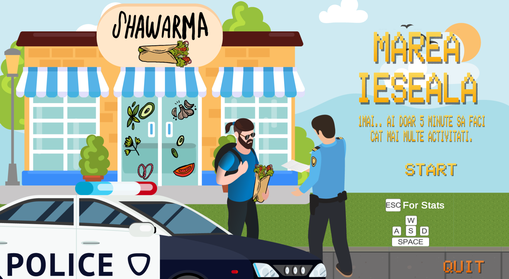
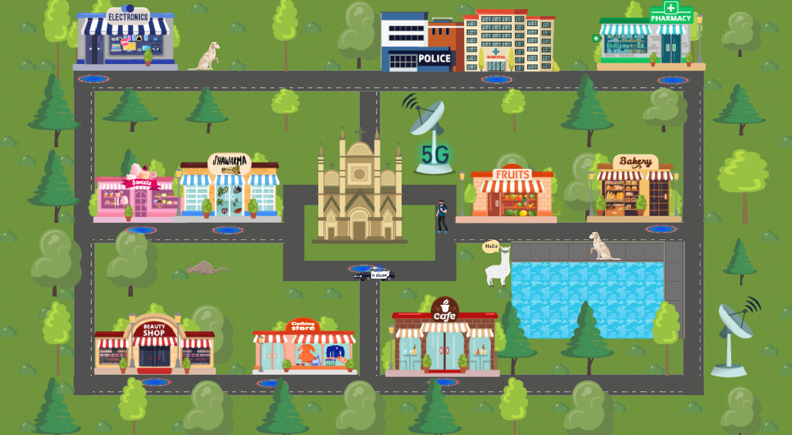

# 🏃 Marea Ieseală (The Great Escape)

**A charity game created during the COVID-19 pandemic to support hospitals.**  
Your mission? Sneak out, do as many fun activities as possible… **without getting caught by the police** while you were supposed to stay in quarantine. 🚓😅  

---

## 🎮 Gameplay
- 🕵️ Try to sneak around and "escape" quarantine  
- 🏖️ Do as many activities as possible before you’re busted  
- 🚓 Avoid the police – they’re everywhere!  
- 😂 Fun, lighthearted take on a serious time  

---

## 💡 Why this game?
This project was built **for charity** during the COVID-19 pandemic.  
The goal was to raise money for hospitals while keeping people entertained during lockdown.  
A little laughter + gaming = good medicine ❤️  

---

## 🛠️ Tech & Tools
- **Engine**: Unity  
- **Language**: C#  
- **Art**: Homemade + free assets  
- **Built with love for a good cause** 💙  

---

## 🚀 How to Play
1. Download the game (see [Releases](https://github.com/emoraru/The_Great_Escape_2D/releases/tag/1.01))
2. Extract & run the executable  
3. Try not to get caught 👀  

---

## 🧑‍🤝‍🧑 Credits
- Special thanks to everyone who donated to "Game Jam de casa"  

---

## 😂 Fun Quote
> "Stay home, stay safe… or get caught in *Marea Ieseală*! 🚓💨"
